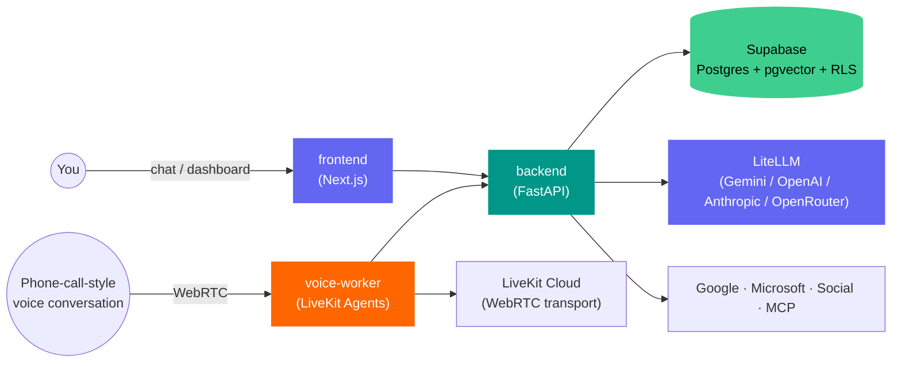

<div align="center">

 

# Kin by PersonaliAI

**An open-source AI personal assistant — chat, memory, real voice calls, and real actions across your calendar, email, and social accounts.**

Self-host it with Docker, or use the hosted version. Same code either way — no vendor lock-in.

[](LICENSE)
[](https://github.com/PersonaliAI/kin/actions/workflows/ci.yml)
[](frontend)
[](backend)
[](https://supabase.com)
[](https://livekit.io)
[](https://github.com/BerriAI/litellm)
[](docker-compose.yml)
[](CONTRIBUTING.md)

[Documentation](#-configuration-reference) · [Quick Start](#-quick-start-docker-compose) · [Features](#-features) · [Architecture](#-architecture) · [Contributing](#-contributing)

</div>

---

## Why Kin

Most "AI assistant" products are a chat window bolted onto an LLM API — closed source, one model, your data on someone else's server. Kin is the actual thing: a personal assistant that remembers context across conversations, takes real actions (books meetings, sends email, posts to your socials, checks your calendar), and talks to you over a real phone-call-style voice channel — not just text.

|  | Closed-source assistant SaaS | **Kin** |
|---|---|---|
| Your data | Lives on their servers, always | Your own Supabase project |
| LLM | Locked to one vendor | **Any provider** — Gemini, OpenAI, Anthropic, OpenRouter, via [LiteLLM](https://github.com/BerriAI/litellm), with automatic fallback |
| Cost visibility | A monthly bill, no breakdown | Per-request token + dollar cost tracking, logged to your own database |
| Voice | Usually absent or a separate pricier tier | Included — real-time voice agent via LiveKit, same memory as chat |
| Integrations | Whatever they decided to build | Google/Microsoft calendar & email, 15+ social platforms, MCP servers, custom webhooks |
| Source code | Closed | **MIT licensed** — fork it, audit it, self-host it |

## ✨ Features

- 💬 **Tool-calling chat agent** — multi-round reasoning loop that actually does things, not just talks about them
- 🎙️ **Real-time voice agent** — phone-call-style conversations via LiveKit, BYOK across OpenAI/Anthropic/Google/Groq/xAI for LLM, plus Deepgram/ElevenLabs/Cartesia/Azure and more for STT/TTS
- 🧠 **Persistent memory + RAG** — remembers facts across conversations, grounded answers over your own uploaded documents (PDF/DOCX/XLSX/PPTX via [markitdown](https://github.com/microsoft/markitdown))
- 🔌 **Real integrations** — Google Calendar/Gmail/Drive/Contacts/Tasks, Microsoft 365 equivalents, 15+ social platforms (LinkedIn, X, Instagram, TikTok, Reddit, Discord, Bluesky, Farcaster, and more), MCP server support
- 💰 **Multi-provider LLM via LiteLLM** — Gemini by default with automatic model fallback, or bring your own OpenAI/Anthropic/OpenRouter key, with **per-request token and dollar cost tracking** built in
- 🗓️ **Agentic scheduling** — books real meetings, sends follow-ups, runs on autopilot within limits you set
- 📊 **Dashboard** — chat, memory browser, integrations, social scheduling, voice-agent config, billing, usage
- 🐳 **One-command self-host** — `docker compose up`, point it at a free Supabase project, done

## 🏗️ Architecture



```
kin/
├── frontend/       Next.js — dashboard and chat UI
├── backend/        FastAPI — chat/tool-calling agent, memory/RAG, integrations, billing
│   └── app/core/llm.py   unified LiteLLM layer: fallback, streaming, cost tracking
├── voice-worker/   LiveKit Agents — phone/voice-call handling (BYOK per provider)
└── docker-compose.yml
```

All services share a single Supabase Postgres database — schema + row-level security policies, no separate ORM. Supabase's free tier is enough to get started.

> **Note on `voice-worker`:** it talks to LLM/STT/TTS providers directly through LiveKit's own plugins with per-user BYOK keys fetched from `backend` at call time — it does not go through the LiteLLM layer. That's intentional: LiveKit's agent runtime doesn't have a generic LiteLLM plugin, so this is a deliberate architectural split, not an oversight.

## 🚀 Quick Start (Docker Compose)

**1. Create a Supabase project** at [supabase.com](https://supabase.com) — free tier is fine. Grab these from **Project Settings → API** and **→ Database**: Project URL, `anon` key, `service_role` key, database host/password.

**2. Apply the database schema:**

```bash
cd backend
# apply every file in supabase/migrations/ in order, via the Supabase CLI
# (supabase db push) or the SQL editor in your Supabase dashboard
```

**3. Configure environment variables:**

```bash
cp backend/.env.example backend/.env              # Supabase + GEMINI_API_KEY at minimum
cp frontend/.env.example frontend/.env.local       # Supabase URL + anon key + backend URL
cp voice-worker/.env.example voice-worker/.env     # only needed for the voice profile
```

At minimum you need: `SUPABASE_URL`, `SUPABASE_SERVICE_ROLE_KEY` (backend), `GEMINI_API_KEY` (free at [aistudio.google.com/apikey](https://aistudio.google.com/apikey)), `FUNCTION_SECRET` and `BYOK_ENCRYPTION_KEY` (generate your own random values). Everything else is optional — each one unlocks a single feature (voice, a specific social platform, billing, etc.) and degrades gracefully when left blank. Every variable is documented inline in each service's `.env.example`.

**4. Run it:**

```bash
docker compose up --build backend frontend
```

Dashboard: `http://localhost:3000` · Backend: `http://localhost:8080`

To also run the voice agent (needs a free [LiveKit Cloud](https://cloud.livekit.io) project):

```bash
docker compose --profile voice up --build
```

## 💻 Local Development (without Docker)

**Backend:**
```bash
cd backend
pip install -r requirements.txt
uvicorn main:app --reload --port 8080
```

**Frontend:**
```bash
cd frontend
npm install
npm run dev
```

**Voice worker** (optional):
```bash
cd voice-worker
pip install -r requirements.txt
python worker.py dev
```

## ⚙️ Configuration Reference

Every environment variable is documented inline in [`backend/.env.example`](backend/.env.example), [`frontend/.env.example`](frontend/.env.example), and [`voice-worker/.env.example`](voice-worker/.env.example) — what it's for, and what happens if you leave it blank.

## 🗺️ Roadmap

- [ ] Test coverage for `frontend/` and `voice-worker/` (currently backend-only)
- [ ] One-click deploy buttons (Railway / Render / Fly.io)
- [ ] Complete the LiteLLM migration — tool-calling loop is done behind a `KIN_USE_LITELLM` flag pending live-traffic verification, `google-genai` removal is the last step
- [ ] Streaming responses over the LiteLLM path

Have an idea? [Open an issue](https://github.com/PersonaliAI/kin/issues).

## 🤝 Contributing

Issues and PRs welcome — see [CONTRIBUTING.md](CONTRIBUTING.md) for dev setup per service. Good first areas: voice-worker test coverage, additional STT/TTS provider plugins, docs.

## 📄 License

MIT — see [LICENSE](LICENSE). Use it, fork it, ship it commercially — attribution appreciated but not required.

---

<div align="center">

If Kin is useful to you, **star the repo** ⭐ — it helps other people find it.

</div>
